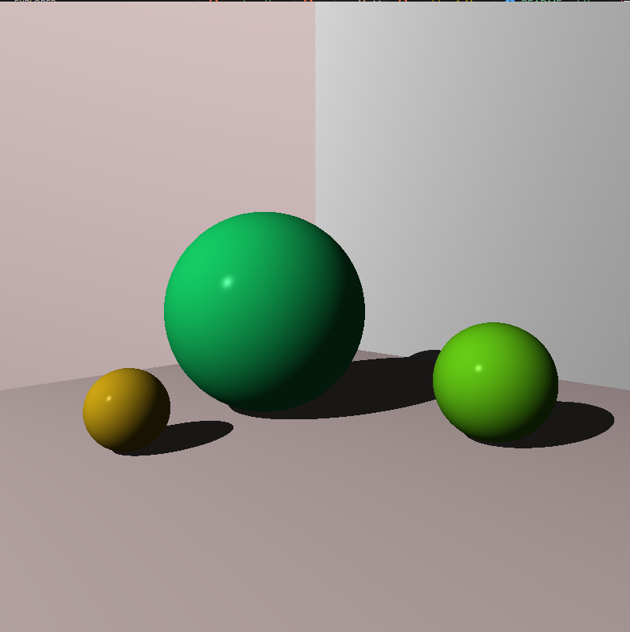

# rustracer

 This is an implementation in Rust of the book [The Ray Tracer Challenge](http://www.raytracerchallenge.com). Great book that teach raytracing and test driven developpement.

 My objective is to 

## Points of interest

## chapters
- [X] chapter 10 : Patterns
- [ ] chapter 11 : Reflection and Refraction
- [ ] chapter 12 : Cubes
- [ ] chapter 13 : Cylinders
- [ ] chapter 14 : Groups
- [ ] chapter 15 : Triangles
- [ ] chapter 16 : Constructive Solid Geometry (CSG)
- [ ] chapter 17 : Next Steps

## Possible improvements
- [ ] End chapters
- [ ] Benchmarks
- [ ] Parallelization with [rayon](https://github.com/rayon-rs/rayon)
- [ ] cache Matrices inversion
- [ ] Avoid creating a new vec for each call to a shape intersects() method using a kind of closure (it should provides an interesting speedup as it prevents the dynamic allocation of many temporaries)
- [ ] Anti-aliasing
- [ ] Separate Tests from code for readability
- [ ] File config for scenes
- [ ] ADD config files
- [ ] Allow to save Images
- [ ] Add GUI
- [ ] Clean style
- [ ] Up Rust version

## Some samples

